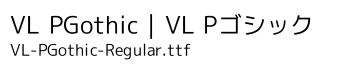
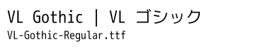

<!-- -*- coding: utf-8 -*- -->
# VLゴシックフォントファミリ / VLGothic Font Family

VLゴシックフォントファミリは、M+アウトラインフォントベースのモダンゴシック体の日本語 TrueType フォントで、次のような特徴を持っています。

* [M+ FONTS PORJECT](http://mplus-fonts.osdn.jp/index.html)による M+1C および M+1M フォントを英数字、かな、および一部の漢字(教育漢字を含む約2000文字)に使用
* 不足部分の一部(約2500文字)を[Project Vine](http://vinelinux.org/)の[鈴木大輔](http://dicey.org/)が M+ の漢字部品を元に新規に製作したものを使用
* 残りの部分[Electronic Font Open Laboratory](http://openlab.jp/efont/)による[さざなみゴシックフォント](http://wiki.fdiary.net/font/?sazanami)をベースに[Project Vine](http://vinelinux.org/)が改変したもので補填
* Latin 1 Supplement を含む一部の文字、記号をM+の英数などの部品を元に作成したものを追加(VLGothic)
* 全角記号の一部を新規に作成し追加
* ギリシャ文字をSans-serif風に修正

M+ FONTS 由来の部分はほぼ未改変ですが、さざなみフォント由来の部分には常用漢字 を中心に[Project Vine](http://vinelinux.org/)および[Daisuke SUZUKI](http://dicey.org/)により2500文字程度のグリフを M+ の漢字グリフをベースに新規に作りなおしました。

また全角英数、記号類および ギリシャ文字の大文字は M+1Pのアルファベットをベースに改変したものを使用しています。

VLGothic には M+ 1C Regular と組み合わせたプロポーショナルフォントである VL PGothic フォントと、M+ 1M Regular と組み合わせた固定幅フォントである VL Gothicフォントが含まれます。

## VLゴシックフォントファミリライセンス

VLゴシックフォント全体としての[ライセンス](LICENSE.ja)は[修正BSDライセンス(The 3-Clause BSD License)](https://opensource.org/license/bsd-3-clause/)とします。

M+ FONTS 由来の部分については、M+ FONTS PROJECT のライセンスが適用されます。添付の [LICENSE_J.mplus](LICENSE_J.mplus) を参照してください。

さざなみゴシックフォント由来の部分およびそれらの部品を元に改変した一部の文字については、さざなみフォントと同様に修正BSDライセンスとします。オリジナルのさざなみフォントのライセンスについては添付の [README.sazanami](README.sazanami) を参照してください。

その他　VL ゴシックフォントファミリで独自に追加した文字、および M+フォントの部品を元に独自に作成した文字(2007/05/06以降に修正した漢字および記号)はM+フォントと同じライセンスを摘要します。

なお、文書への埋め込みなど、フォントとしての再使用を目的としない用途においては、以下で言う Redistribution には当たらず、制限なく行えるものとします。

## サンプル

### 可変幅フォント

### 固定幅フォント

